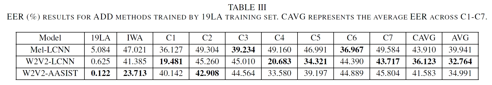
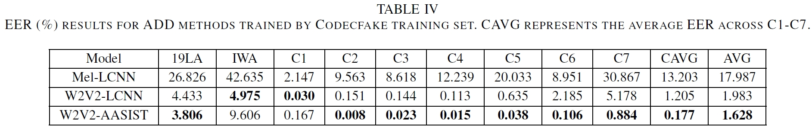
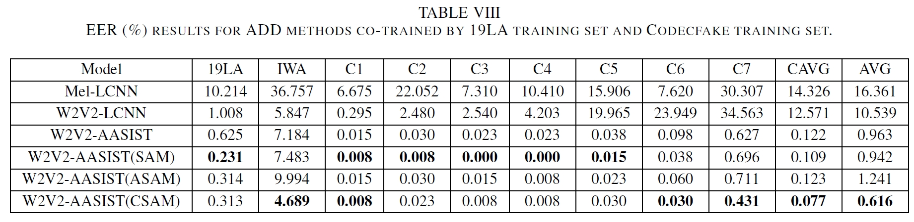

# The Codecfake Dataset and Countermeasures for the Universally Detection of Deepfake Audio

<p align="center">
  
</p>
<h2 align="center">ALM-based deepfake audio</h1>
This is the official repo of our work titled The Codecfake Dataset and Countermeasures for the Universally Detection of Deepfake Audio, which was available on arxiv at https://arxiv.org/abs/2405.04880.

## 📚 Codecfake Dataset
Due to platform restrictions on the size of zenodo repositories, we have divided the Codecfake dataset into various subsets as shown in the table below:


|Codecfake dataset | Description     | Link                                                                                                                                                                                                                                                                                                                                                        |
|------------------|----------------|--------------|
|training set (part 1 of 3) & label|train_split.zip & train_split.z01 - train_split.z06| https://zenodo.org/records/11171708|
|training set (part 2 of 3) | train_split.z07 - train_split.z14| https://zenodo.org/records/11171720
|training set (part 3 of 3)| train_split.z15 - train_split.z19| https://zenodo.org/records/11171724
|development set|dev_split.zip & dev_split.z01 - dev_split.z02| https://zenodo.org/records/11169872
|test set (part 1 of 2)|Codec test: C1.zip - C6.cip & ALM test: A1.zip - A3.zip| https://zenodo.org/records/11169781
|test set (part 2 of 2)|Codec unseen test: C7.zip|https://zenodo.org/records/11125029

## 🛡️ Countermeasure
### 1. Data prepraring
Upon downloading the Codecfake datasets, please arrange them in accordance with the directory structure outlined below:
```
├── Codecfake
│   ├── label
│   │   └── *.txt
│   ├── train
│   │   └── *.wav (740,747 samples)
│   ├── dev
│   │   └── *.wav (92,596 samples)
│   ├── test
│   │   └── C1
│   │   │   └── *.wav (26,456 samples)
│   │   └── C2
│   │   │   └── *.wav (26,456 samples)
│   │   └── C3
│   │   │   └── *.wav (26,456 samples)
│   │   └── C4
│   │   │   └── *.wav (26,456 samples)
│   │   └── C5
│   │   │   └── *.wav (26,456 samples)
│   │   └── C6
│   │   │   └── *.wav (26,456 samples)
│   │   └── C7
│   │   │   └── *.wav (145,505 samples)
│   │   └── A1
│   │   │   └── *.wav (8,902 samples）
│   │   └── A2
│   │   │   └── *.wav (8,902 samples）
│   │   └── A3
│   │   │   └── *.wav (99,112 samples）
```
If you want to co-training with ASVspoof2019, Please download the training, development and evaluation set from [ASVspoof2019 LA Database](https://datashare.ed.ac.uk/handle/10283/3336) first.

### 2. Offline Feature Extraction
```
python preprocess.py 
```

Please ensure the data and label position are correct. If you need to adjust, please modify in `./preprocess.py`.

After preprocess, the hidden states of wav2vec2 will be saved in `/data2/xyk/codecfake/preprocess_xls-r-5`. 

### 3. Train

Training on different task:
```
python main_train.py -t 19LA 
python main_train.py -t codecfake
python main_train.py -t co-train 
```
Before running the `main_train.py`, please change the `path_to_features` according to the location of pre-processed featrue
on your machine.

If training is slow, consider adjusting the num_worker parameter in conjunction with the number of CPU cores. 
The default is set to 8. If performance remains slow, you may explore multi-GPU training in args.


### 4. Test
Testing on different datasets was performed using the best pre-trained model, which is saved in `./models/try/anti-spoofing_feat_model.pt`:
```
python generate_score.py -t 19LA
python generate_score.py -t ITW
python generate_score.py -t codecfake
```
The result will be saved in `./result`.
```
python evaluate_score.py 
```
You will get the final test EER.

###  5. Pre-trained model
We provide pre-trained models and score results as mentioned in our paper, you can use our pre-trained models testing on other condition.
The inference step can refer section 4.

#### Vocoder-trained ADD models:
<p align="center">
  
</p>

```
./pretrained_model/vocoder_mellcnn/anti-spoofing_feat_model.pt
./pretrained_model/vocoder_w2v2lcnn/anti-spoofing_feat_model.pt
./pretrained_model/vocoder_w2v2aasist/anti-spoofing_feat_model.pt
```


#### Codec-trained ADD models:
<p align="center">
  
</p>

```
./pretrained_model/codec_mellcnn/anti-spoofing_feat_model.pt
./pretrained_model/codec_w2v2lcnn/anti-spoofing_feat_model.pt
./pretrained_model/codec_w2v2aasist/anti-spoofing_feat_model.pt
```

#### Co-trained ADD model:
<p align="center">
  
</p>

```
./pretrained_model/cotrain_w2v2aasist/anti-spoofing_feat_model.pt
```


## 📝 Citation

If you find our dataset or countermeasure is useful to your research, please cite it as follows:

```
@article{xie2024codecfake,
  title={The Codecfake Dataset and Countermeasures for the Universally Detection of Deepfake Audio},
  author={Xie, Yuankun and Lu, Yi and Fu, Ruibo and Wen, Zhengqi and Wang, Zhiyong and Tao, Jianhua and Qi, Xin and Wang, Xiaopeng and Liu, Yukun and Cheng, Haonan and others},
  journal={arXiv preprint arXiv:2405.04880},
  year={2024}
}
```


